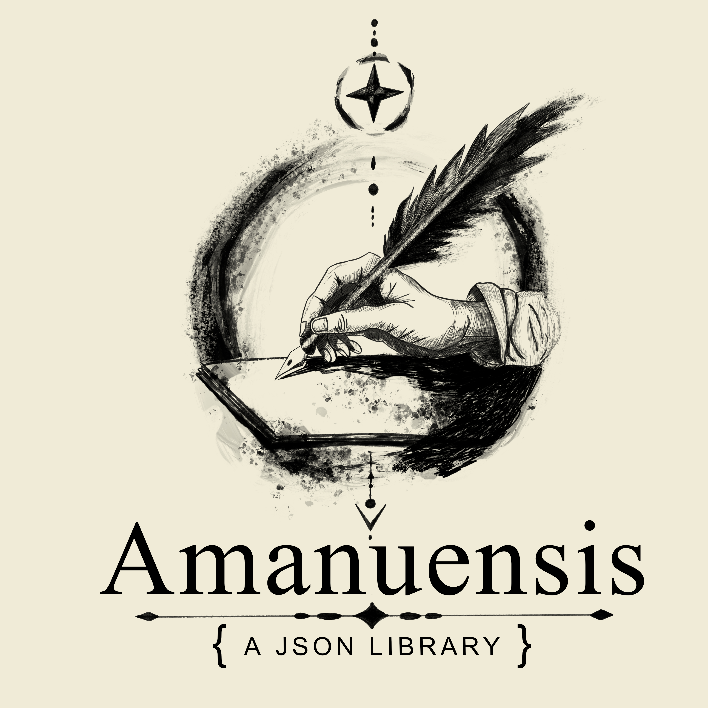

# Amanuensis

A zero-dependency C++20 JSON read/write library. Minimal feature surface, insertion-order preserving, consumed via CMake `add_subdirectory`.

---

## Overview

Amanuensis reads and writes JSON conforming to [RFC 8259](https://www.rfc-editor.org/rfc/rfc8259). 
The library is deliberately minimal. It covers the subset of JSON that real first-party projects actually use, and nothing more.

---

## Goals

- Read and write JSON conforming to RFC 8259
- Preserve insertion order on write so generated files are stable under diffing
- Zero external dependencies — C++20 stdlib only
- Consumed via CMake `add_subdirectory`
- Human-readable output by default (pretty-printed, 2-space indent)
- Minified output mode for wire formats and size-sensitive use cases
- Clear error reporting on parse failure — line, column, and reason
- Low-boilerplate serialisation of user types via a tiered opt-in system

## Non-Goals

- JSON Schema validation
- Streaming / incremental parsing
- Binary formats (BSON, CBOR, MessagePack)
- Runtime-reflection-based automatic serialisation
- JSON5, JSONC, or other relaxed dialects
- Performance parity with SIMD-optimised parsers like simdjson

---

## Integration

Add Amanuensis as a subdirectory under `libs/` and link against it:

```cmake
add_subdirectory(libs/amanuensis)
target_link_libraries(your_target PRIVATE amanuensis)
```

Then include the umbrella header:

```cpp
#include <amanuensis/amanuensis.hpp>
```

Or include individual headers as needed:

```cpp
#include <amanuensis/value.hpp>
#include <amanuensis/io/reader.hpp>
#include <amanuensis/io/writer.hpp>
#include <amanuensis/serialisation.hpp>
```

---

## Building

### Library only

```bash
cmake -B build
cmake --build build
```

### With tests

Tests require [Cimmerian](https://github.com/DeanWilsonDev/Cimmerian) to be installed. Tests are enabled by default.

```bash
cmake -B build -Damanuensis_BUILD_TESTS=ON
cmake --build build
./build/bin/test_amanuensis
```

To disable tests:

```bash
cmake -B build -Damanuensis_BUILD_TESTS=OFF
```

---

## API

All public symbols live in the `Amanuensis` namespace.

### Reading

`Reader` has two static methods and returns a result struct — it never throws on parse failure.

```cpp
auto result = Amanuensis::Reader::ParseString(R"({"x": 1})");

if (!result.succeeded) {
    std::cerr << result.error.line << ":" << result.error.column
              << " — " << result.error.message << "\n";
    return 1;
}

Amanuensis::Value root = result.value;
```

```cpp
auto result = Amanuensis::Reader::ParseFile("config.json");
```

### Writing

`Writer` has two static methods. `WriteToFile` returns `bool` rather than throwing on I/O failure.

```cpp
Amanuensis::Value root = Amanuensis::Value::MakeObject();
root.Insert("version", 1);
root.Insert("name", "example");

// Pretty-printed (default)
std::string text = Amanuensis::Writer::WriteToString(root);

// Minified
Amanuensis::WriterOptions options;
options.pretty = false;
std::string minified = Amanuensis::Writer::WriteToString(root, options);

// Write to disk
bool ok = Amanuensis::Writer::WriteToFile(root, "output.json");
```

### The Value type

```cpp
// Construction
Amanuensis::Value null;                        // null
Amanuensis::Value boolean = true;
Amanuensis::Value integer = 42;
Amanuensis::Value number = 3.14;
Amanuensis::Value text = "hello";
Amanuensis::Value array = Amanuensis::Value::MakeArray();
Amanuensis::Value object = Amanuensis::Value::MakeObject();

// Type inspection
value.IsNull();
value.IsBoolean();
value.IsInteger();
value.IsDouble();
value.IsNumber();    // true for Integer or Double
value.IsString();
value.IsArray();
value.IsObject();

// Typed accessors — throw TypeMismatchError on wrong type
bool        b = value.AsBoolean();
long long   i = value.AsInteger();
double      d = value.AsDouble();
std::string s = value.AsString();

// Array operations
array.PushBack(99);
std::size_t count = array.Size();
Amanuensis::Value& element = array.At(0);

// Object operations — insertion order is preserved
object.Insert("key", "value");
bool exists = object.Contains("key");
Amanuensis::Value& v = object.Get("key");        // throws if absent
const Amanuensis::Value* p = object.Find("key"); // nullptr if absent
```

---

## User-type Serialisation

Amanuensis provides `ToJson<T>` and `FromJson<T>` for user types that opt in via one of three mechanisms.

### Mechanism 1 — `AMANUENSIS_SERIALISABLE` macro (recommended for most types)

One line per type. Field names are used as-is for both the C++ identifier and the JSON key.

```cpp
struct PerFunctionCoverage {
    std::string qualifiedName;
    int startLine;
    int endLine;
    int linesTotal;
    int linesCovered;
    int executionCount;
};

AMANUENSIS_SERIALISABLE(
    PerFunctionCoverage,
    qualifiedName, startLine, endLine,
    linesTotal, linesCovered, executionCount
);
```

Both directions then work automatically:

```cpp
// Serialise
PerFunctionCoverage pfc = { "math::Add", 10, 14, 5, 5, 3 };
Amanuensis::Value v = Amanuensis::ToJson(pfc);
Amanuensis::Writer::WriteToFile(v, "coverage.json");

// Deserialise
auto result = Amanuensis::Reader::ParseFile("coverage.json");
PerFunctionCoverage roundTripped = Amanuensis::FromJson<PerFunctionCoverage>(result.value);

// Non-throwing variant
auto tryResult = Amanuensis::TryFromJson<PerFunctionCoverage>(result.value);
if (!tryResult.succeeded) {
    std::cerr << tryResult.errorMessage << "\n";
}
```

Nested types and `std::vector<T>`, `std::optional<T>`, and `std::map<std::string, T>` are supported out of the box as long as the element type has also opted in.

> **Note:** Bare commas in macro arguments cause preprocessor issues. Template types (e.g. `std::map<K, V>`) and braced initialisers inside `AMANUENSIS_SERIALISABLE` arguments should use `using` aliases or file-scope factory functions as workarounds.

### Mechanism 2 — Intrusive `Serialise` member

For types that need custom JSON key names, computed fields, or versioning logic. The same method handles both read and write directions.

```cpp
struct RenamedFields {
    std::string name;
    int count;

    template <typename Archive>
    void Serialise(Archive& archive) {
        archive.Field("display_name", name);
        archive.Field("item_count", count);
    }
};
```

### Mechanism 3 — `JsonTraits<T>` specialisation

For types you do not own (external types), or for types that require a non-object JSON representation.

```cpp
namespace Amanuensis {
template <> struct JsonTraits<Vec3> {
    static Value ToJson(const Vec3& v) {
        auto array = Value::MakeArray();
        array.PushBack(v.x);
        array.PushBack(v.y);
        array.PushBack(v.z);
        return array;
    }
    static Vec3 FromJson(const Value& value) {
        return { value.At(0).AsDouble(), value.At(1).AsDouble(), value.At(2).AsDouble() };
    }
};
} // namespace Amanuensis
```

---

## Testing

Tests are written using [Cimmerian](https://github.com/DeanWilsonDev/Cimmerian), a first-party BDD-style C++ testing framework. This is not a circular build dependency — `libamanuensis` has no project dependencies. Only the `test_amanuensis` binary links against Cimmerian.

---

## Requirements

- C++20 or later
- GCC 13+ / Clang 16+ / MSVC 19.29+ (any compiler with C++20 support)
- CMake 3.25+
