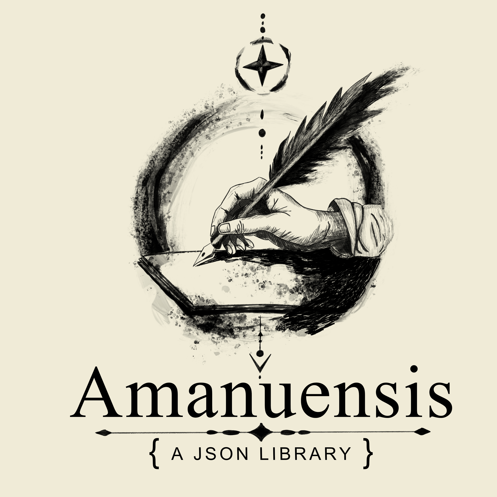

# Amanuensis

A zero-dependency C++26 JSON read/write library. Minimal feature surface, insertion-order preserving, consumed via CMake `add_subdirectory`.

---

## Overview

Amanuensis reads and writes JSON conforming to [RFC 8259](https://www.rfc-editor.org/rfc/rfc8259). 
The library is deliberately minimal. It covers the subset of JSON that real first-party projects actually use, and nothing more.

---

## Goals

- Read and write JSON conforming to RFC 8259
- Preserve insertion order on write so generated files are stable under diffing
- Zero external dependencies — C++26 stdlib only
- Consumed via CMake `add_subdirectory`
- Human-readable output by default (pretty-printed, 2-space indent)
- Minified output mode for wire formats and size-sensitive use cases
- Clear error reporting on parse failure — line, column, and reason
- Low-boilerplate serialisation of user types via a tiered opt-in system

## Non-Goals

- JSON Schema validation
- Streaming / incremental parsing
- Binary formats (BSON, CBOR, MessagePack)
- Runtime-reflection-based automatic serialisation
- JSON5, JSONC, or other relaxed dialects
- Performance parity with SIMD-optimised parsers like simdjson

---

## Integration

Add Amanuensis as a subdirectory under `libs/` and link against it:

```cmake
add_subdirectory(libs/amanuensis)
target_link_libraries(your_target PRIVATE amanuensis)
```

Then include the umbrella header:

```cpp
#include <amanuensis.hpp>
```

Or include individual headers as needed:

```cpp
#include <amanuensis/core/value.hpp>                   // amanuensis::core::Value
#include <amanuensis/json.hpp>                         // amanuensis::Json, the operations on a Value
#include <amanuensis/json/reader.hpp>                  // amanuensis::json::Reader
#include <amanuensis/json/writer.hpp>                  // amanuensis::json::Writer
#include <amanuensis/serialization/serialization.hpp>  // ToValue, FromValue, AMANUENSIS_SERIALISABLE
```

---

## Building

### Library only

```bash
cmake -B build -DAMANUENSIS_BUILD_TESTS=OFF
cmake --build build
```

### With tests

Tests use [Cimmerian](https://github.com/DeanWilsonDev/Cimmerian), which is a git submodule at `external/cimmerian`. Tests are enabled by default when Amanuensis is the top-level project.

```bash
git submodule update --init
cmake -B build
cmake --build build
./build/test_amanuensis
```

---

## API

The data model and everything the formats share lives in `amanuensis::core`, and the JSON reader and writer live in `amanuensis::json`. The serialisation layer (`ToValue`, `FromValue`, `SerialTraits`) is in `amanuensis`. For now, the operations on a `Value` are static functions on `amanuensis::Json`.

Until consumers have moved over, `<amanuensis/compat.hpp>` (pulled in by every public header) keeps the old names working:

- the `Amanuensis::` namespace spelling;
- `JsonValue`, `JsonValueType`, `JsonParseResult` and `JsonParseError`, as aliases of `core::Value`, `core::ValueType`, `core::ParseResult` and `core::ParseError`;
- `ToJson`, `FromJson`, `TryFromJson` and `FromJsonResult`, which forward to `ToValue`, `FromValue`, `TryFromValue` and `FromValueResult`, and `JsonTraits<T>` specialisations with `ToJson`/`FromJson` members, which are still picked up when there is no `SerialTraits<T>` one;
- `amanuensis::Reader`, `Writer` and `WriterOptions`, now in `amanuensis::json`, and `amanuensis::OrderedMap`, `ObjectIterator`, `Converter`, `ValueTraits` and the error types, now in `amanuensis::core`;
- the old header paths, such as `<amanuensis/io/reader.hpp>` and `<amanuensis/json-value.hpp>`, which forward to the new ones.

Define `AMANUENSIS_NO_COMPAT` to turn all of this off.

### Reading

`Reader` has two static methods and returns a result struct — it never throws on parse failure.

```cpp
auto result = amanuensis::json::Reader::ParseString(R"({"x": 1})");

if (!result.succeeded) {
    std::cerr << result.error.line << ":" << result.error.column
              << " — " << result.error.message << "\n";
    return 1;
}

amanuensis::core::Value root = result.value;
```

```cpp
auto result = amanuensis::json::Reader::ParseFile("config.json");
```

### Writing

`Writer` has two static methods. `WriteToFile` returns `bool` rather than throwing on I/O failure.

```cpp
using amanuensis::Json;
using amanuensis::core::Value;

Value root = Json::MakeObject();
Json::Insert(root, "version", Value{1LL});
Json::Insert(root, "name", Value{std::string("example")});

// Pretty-printed (default)
std::string text = amanuensis::json::Writer::WriteToString(root);

// Minified
amanuensis::json::WriterOptions options;
options.pretty = false;
std::string minified = amanuensis::json::Writer::WriteToString(root, options);

// Write to disk
bool ok = amanuensis::json::Writer::WriteToFile(root, "output.json");
```

### The Value type

`core::Value` holds null, a boolean, an integer (`long long`), a double, a string, an array or an object. Objects keep their insertion order.

```cpp
using amanuensis::Json;
using amanuensis::core::Value;

// Construction
Value null_value;                          // null
Value boolean{true};
Value integer{42LL};
Value number{3.14};
Value text{std::string("hello")};
Value array = Json::MakeArray();
Value object = Json::MakeObject();

// Type inspection
Json::GetType(value);     // amanuensis::core::ValueType
Json::IsNull(value);
Json::IsBoolean(value);
Json::IsInteger(value);
Json::IsDouble(value);
Json::IsNumber(value);    // true for Integer or Double
Json::IsString(value);
Json::IsArray(value);
Json::IsObject(value);

// Typed accessors — throw amanuensis::core::TypeMismatchError on wrong type
bool        b = Json::AsBoolean(value);
long long   i = Json::AsInteger(value);
double      d = Json::AsDouble(value);
std::string s = Json::AsString(value);

// Array operations
Json::PushBack(array, Value{99LL});
std::size_t count = Json::Size(array);
Value& element = Json::At(array, 0);         // throws IndexOutOfRangeError if out of range

// Object operations — insertion order is preserved
Json::Insert(object, "key", Value{std::string("value")});
bool exists = Json::Contains(object, "key");
Value& v = Json::Get(object, "key");         // throws KeyNotFoundError if absent
const Value* p = Json::Find(object, "key");  // nullptr if absent
for (auto entry = Json::BeginObject(object); entry != Json::EndObject(object); ++entry) {
    // entry->first is the key, entry->second the value
}
```

### Merging, comparing and hashing values

`amanuensis::core` has three format-neutral operations on whole values:

```cpp
using amanuensis::core::Value;

// Objects merge key by key; arrays and everything else replace whole.
Value entity = amanuensis::core::Overlay(prefab, overrides);

// The key paths where entity differs from prefab, such as {"position", "x"}.
std::vector<amanuensis::core::KeyPath> changed = amanuensis::core::Diff(prefab, entity);

// FNV-1a 64 over a fixed encoding: the same on every compiler, and key order doesn't matter.
std::uint64_t hash = amanuensis::core::StableHash(prefab);
```

---

## User-type Serialisation

Amanuensis provides `ToValue<T>` and `FromValue<T>` for user types that opt in via one of three mechanisms.

### Mechanism 1 — `AMANUENSIS_SERIALISABLE` macro (recommended for most types)

One line per type. Field names are used as-is for both the C++ identifier and the JSON key.

```cpp
struct PerFunctionCoverage {
    std::string qualifiedName;
    int startLine;
    int endLine;
    int linesTotal;
    int linesCovered;
    int executionCount;
};

AMANUENSIS_SERIALISABLE(
    PerFunctionCoverage,
    qualifiedName, startLine, endLine,
    linesTotal, linesCovered, executionCount
);
```

Both directions then work automatically:

```cpp
// Serialise
PerFunctionCoverage pfc = { "math::Add", 10, 14, 5, 5, 3 };
amanuensis::core::Value v = amanuensis::ToValue(pfc);
amanuensis::json::Writer::WriteToFile(v, "coverage.json");

// Deserialise
auto result = amanuensis::json::Reader::ParseFile("coverage.json");
PerFunctionCoverage roundTripped = amanuensis::FromValue<PerFunctionCoverage>(result.value);

// Non-throwing variant
auto tryResult = amanuensis::TryFromValue<PerFunctionCoverage>(result.value);
if (!tryResult.succeeded) {
    std::cerr << tryResult.errorMessage << "\n";
}
```

Nested types and `std::vector<T>`, `std::optional<T>`, and `std::map<std::string, T>` are supported out of the box as long as the element type has also opted in.

> **Note:** Bare commas in macro arguments cause preprocessor issues. Template types (e.g. `std::map<K, V>`) and braced initialisers inside `AMANUENSIS_SERIALISABLE` arguments should use `using` aliases or file-scope factory functions as workarounds.

### Mechanism 2 — Intrusive `Serialise` member

For types that need custom JSON key names, computed fields, or versioning logic. The same method handles both read and write directions.

```cpp
struct RenamedFields {
    std::string name;
    int count;

    template <typename Archive>
    void Serialise(Archive& archive) {
        archive.Field("display_name", name);
        archive.Field("item_count", count);
    }
};
```

### Mechanism 3 — `SerialTraits<T>` specialisation

For types you do not own (external types), or for types that require a non-object JSON representation.

```cpp
namespace amanuensis {
template <> struct SerialTraits<Vec3> {
    static core::Value ToValue(const Vec3& v) {
        core::Value array = Json::MakeArray();
        Json::PushBack(array, core::Value{v.x});
        Json::PushBack(array, core::Value{v.y});
        Json::PushBack(array, core::Value{v.z});
        return array;
    }
    static Vec3 FromValue(const core::Value& value) {
        return { Json::AsDouble(Json::At(value, 0)),
                 Json::AsDouble(Json::At(value, 1)),
                 Json::AsDouble(Json::At(value, 2)) };
    }
};
} // namespace amanuensis
```

---

## Testing

Tests are written using [Cimmerian](https://github.com/DeanWilsonDev/Cimmerian), a first-party BDD-style C++ testing framework. This is not a circular build dependency — `libamanuensis` has no project dependencies. Only the `test_amanuensis` binary links against Cimmerian.

---

## Requirements

- C++26
- GCC 14+ / Clang 19+ / a recent AppleClang (configure fails on an older GCC or Clang)
- On Windows, clang-cl from Clang 19+; MSVC's cl.exe isn't supported
- CMake 3.30+
